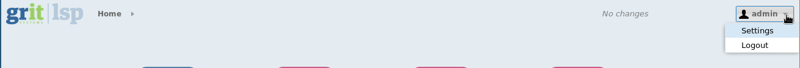
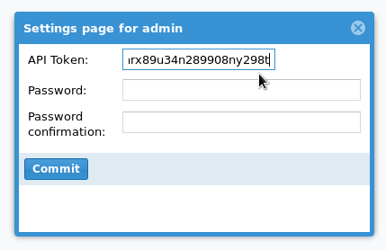

# LSP R Client

The LSP R client package allows R users to extract data from an LSP installation using the LSP REST API.

The prerequisites for connecting to LSP is an API token, which is obtainable from the "User Settings" page in LSP.


# Dependencies

## jsonlite

Available on CRAN, installable with

    install.packages('jsonlite')

## RCurl
Windows users may need to download the binary package from http://cran.r-project.org/web/packages/RCurl/index.html

# Installation

    require(devtools)
    install_github( 'gritsystems/lsprclient', ref='$CURRENT_VERSION' )

where $CURRENT_VERSION is a tag, e.g. `1.0.0`

# Basic usage

## Get your API key from LSP

First off, obtain the API key from LSP by logging in to the LSP installation and pressing your username in the upper right corner




This should open the settings window, where your API key can be obtained.



After installing the LSPRClient, copy the token into the call to the `connectToLSP` function along with the server adress:

```{r}
connectToLSP('https://lspinstallation.yourserver.tld/', 'copied_token_goes_here')
```

And execute the function. If all goes well, you should see the message

```{txt}
Successfully authenticated with LSP API (v0.1.0), ready to continue
```

and you should be all set up to begin querying the LSP installation for data.


# Contributing

Contributions are most welcome!

Fork the repository, create a branch named something relating to the feature/bug you're developing and send us a pull request


